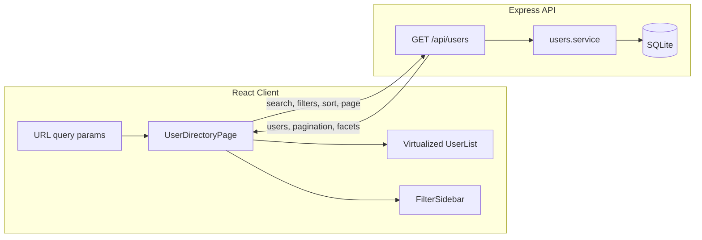

# User Directory — Implementation Guide

## Project Description

This is a full-stack user directory application. It lets users browse a large dataset of people, search by name, filter by nationality and hobbies, sort results, and scroll through matches efficiently.

- A React client with virtualized infinite scrolling and URL-synced filter state
- A Node.js/Express API with clear boundaries and predictable query semantics
- SQLite as the persisted source of truth for user data
- Docker-based local deployment

## Prerequisites

- Node.js 20+ (recommended; Node 18 may work with `--ignore-engines`)
- Yarn 1.x
- Docker & Docker Compose (optional, for containerized run)

## Local Setup

  ### 1. Install dependencies

  ```bash
  yarn install --ignore-engines
  ```

  If `better-sqlite3` fails to load, rebuild the native module:

  ```bash
  cd server && npm rebuild better-sqlite3
  ```

  ### 2. Seed the database

  Creates `./data/directory.db` with ~3,000 synthetic users:

  ```bash
  yarn seed
  ```

  Re-seed from scratch:

  ```bash
  yarn workspace directory-server seed --force
  ```

  ### 3. Start development servers

  ```bash
  yarn dev
  ```

  | Service | URL |
  |---------|-----|
  | React client (Vite) | http://localhost:5173 |
  | Express API | http://localhost:3001 |

  Vite proxies `/api` requests to the server during development.

  ### 4. Production build

  ```bash
  yarn build
  yarn start
  ```

  The server serves the built client from `client/dist` when available.

## Docker Setup

Build and run with Docker Compose:

```bash
docker compose up --build
```

Open http://localhost:3001

- SQLite data is stored in a named Docker volume (`directory-data`)
- The database is auto-seeded on first startup when empty
- API and static client are served from a single container


## Architecture Overview



**Stack**

| Layer | Technology |
|-------|------------|
| Client | React 19, React Router 7, Vite, Tailwind CSS 4, TanStack Virtual |
| Server | Node.js, Express 5, TypeScript |
| Database | SQLite via better-sqlite3 |
| Monorepo | Yarn workspaces |


## Project Structure

```
user-directory/
├── client/                 # React frontend
│   └── src/
│       ├── api/            # API client and fetch helpers
│       ├── components/     # UI components (users, filters, layout, ui)
│       ├── hooks/          # URL state and data-fetching hooks
│       ├── pages/          # Route-level pages
│       └── types/          # Shared TypeScript types
├── server/                 # Express backend
│   └── src/
│       ├── db/             # Schema, connection, seed script
│       ├── routes/         # HTTP route handlers
│       ├── services/       # Business logic and queries
│       ├── types/          # API types
│       └── utils/          # SQL helpers
├── data/                   # SQLite database (created on seed/start)
├── Dockerfile
├── docker-compose.yml
└── instructions.md
```

## API Reference

### `GET /api/health`

Health check for monitoring and Docker.

**Response**

```json
{ "status": "ok" }
```

### `GET /api/users`

Returns paginated users, pagination metadata, and top-20 facet counts for the **active filter state**.

**Query parameters**

| Parameter | Type | Default | Description |
|-----------|------|---------|-------------|
| `search` | string | — | Case-insensitive match on `first_name` or `last_name` |
| `hobbies` | string | — | Comma-separated hobbies (AND semantics) |
| `nationalities` | string | — | Comma-separated nationalities (OR semantics) |
| `sortBy` | string | `first_name` | One of: `first_name`, `last_name`, `age`, `nationality` |
| `sortOrder` | string | `asc` | `asc` or `desc` |
| `page` | number | `1` | Page number (1-based) |
| `limit` | number | `20` | Page size (max 100) |

**Example**

```
GET /api/users?search=ann&hobbies=Reading,Hiking&nationalities=American,British&sortBy=first_name&sortOrder=asc&page=1&limit=20
```

**Response**

```json
{
  "users": [
    {
      "id": 1,
      "avatar": "https://api.dicebear.com/7.x/avataaars/svg?seed=...",
      "first_name": "Anna",
      "last_name": "Smith",
      "age": 32,
      "nationality": "American",
      "hobbies": ["Reading", "Hiking"]
    }
  ],
  "pagination": {
    "page": 1,
    "limit": 20,
    "total": 142,
    "hasMore": true
  },
  "facets": {
    "hobbies": [{ "value": "Reading", "count": 45 }],
    "nationalities": [{ "value": "American", "count": 80 }]
  }
}
```

### Filter Semantics

| Filter | Behavior |
|--------|----------|
| Text search | Matches `first_name` OR `last_name` (case-insensitive) |
| Multiple hobbies | **AND** — user must have **all** selected hobbies |
| Multiple nationalities | **OR** — user nationality must be in the selection |
| Combined | Text, hobby, and nationality filters apply together |

Facet counts (top 20 hobbies and nationalities) always reflect the currently applied text filter and selected filters — not the global dataset.

### Sort Semantics

- Results sort by the chosen field and direction
- `id ASC` is always appended as a deterministic tie-breaker
- Pagination respects the active sort without duplicates or gaps

## Design Decisions

1. **Single `/api/users` endpoint** — Returns users and facet counts in one response so the list and sidebar always stay in sync.
2. **Shared SQL WHERE builder** — The same filter logic powers both the user query and facet aggregation queries.
3. **URL-synced state** — Search, filters, and sort live in query params so views are shareable and reload-safe.
4. **TanStack Virtual** — Renders only visible rows for smooth scrolling through large result sets.
5. **Debounced search** — Reduces API calls while typing in the name filter.

## Environment Variables

| Variable | Default | Description |
|----------|---------|-------------|
| `PORT` | `3001` | Server port |
| `DB_PATH` | `./data/directory.db` | SQLite file path |
| `CLIENT_DIST_PATH` | `../client/dist` | Built client assets |
| `AUTO_SEED` | `true` | Seed DB on startup when empty |
